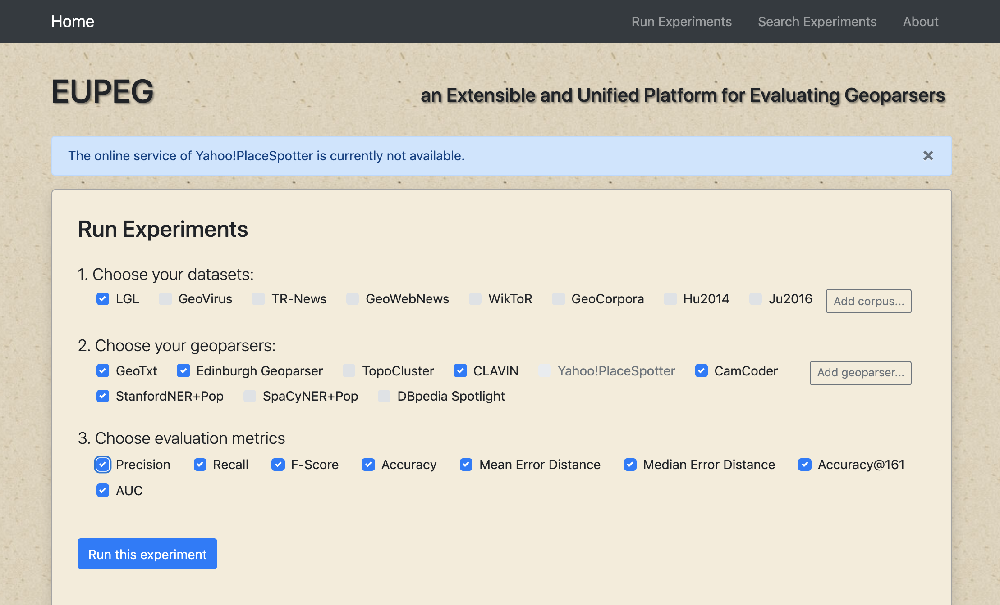
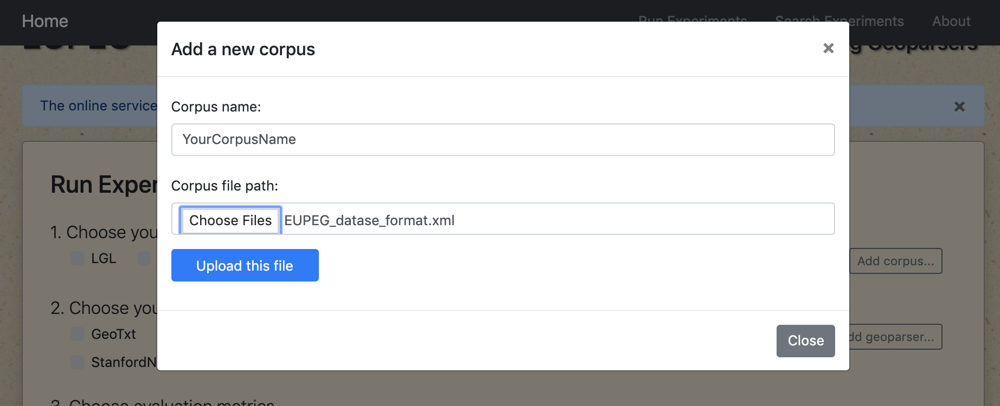
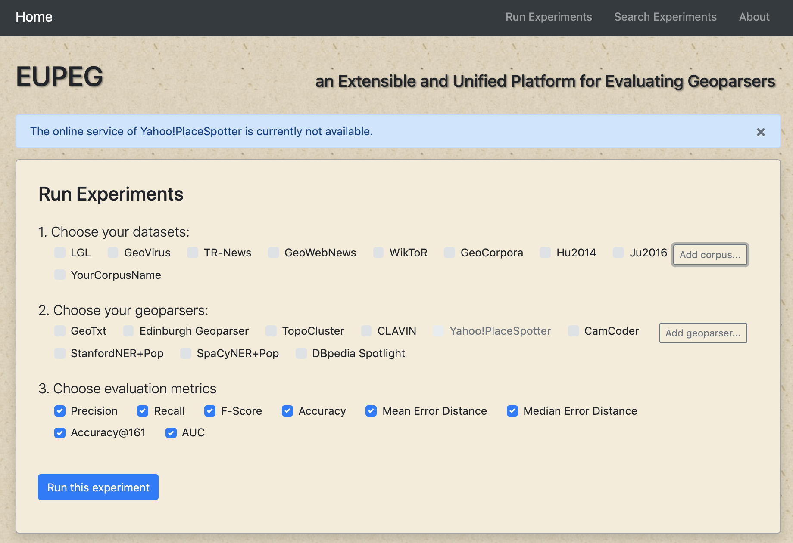
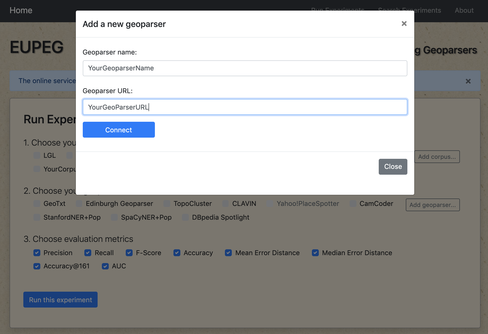
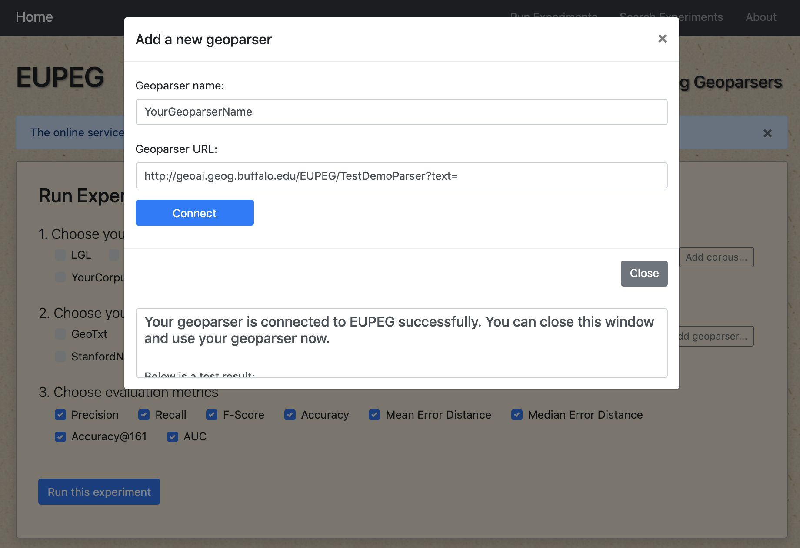
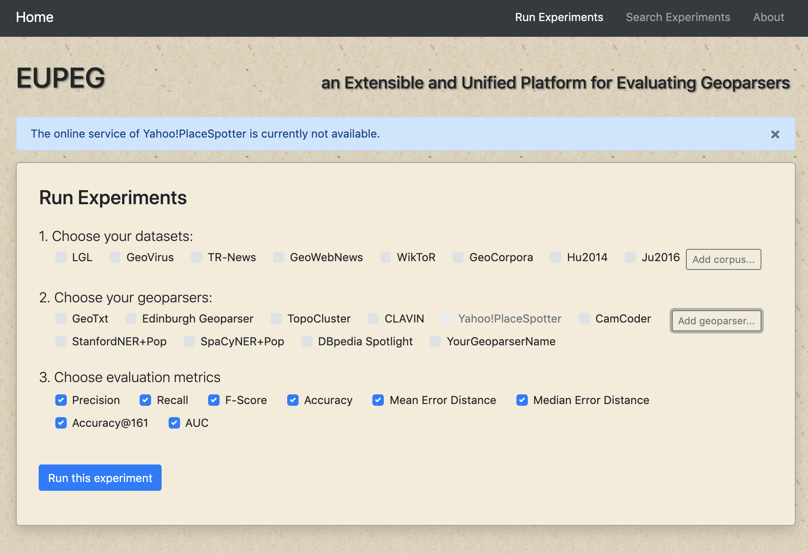
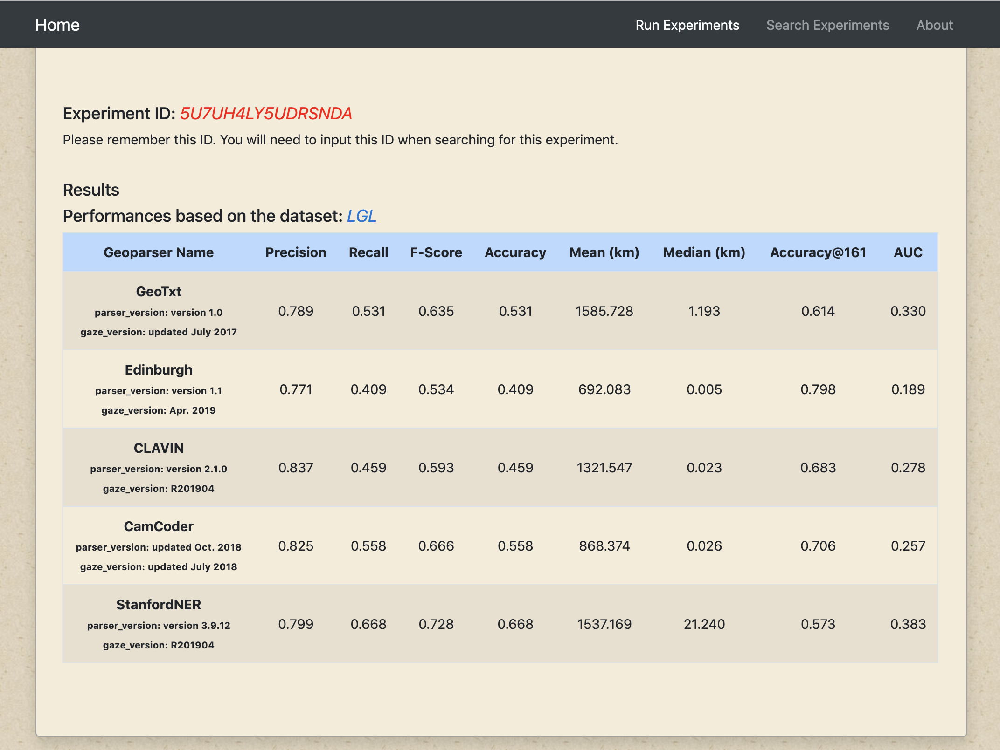
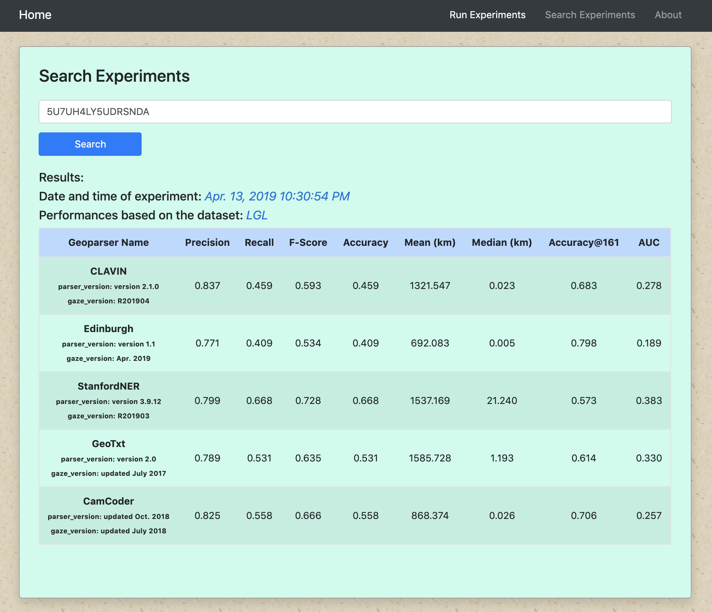

# An Extensible and Unified Platform for Evaluating Geoparsers

#### Overall description
Geoparsers are useful tools that extract structured geographic information from unstructured texts, thereby enabling spatial analysis on textual data. While a number of geoparsers have been developed, they were tested on different datasets using different metrics. Therefore, it is difficult to directly compare the performances of existing geoparsers. Here, we present EUPEG: An Extensible and Unified Platform for Evaluating Geoparsers. EUPEG is an open source and Web based benchmarking platform which hosts a majority of open corpora, geoparsers, and performance metrics reported in the literature. A newly developed geoparser can be connected to EUPEG and compared with other geoparsers based on the hosted datasets and new datasets uploaded. The main objective of EUPEG is to reduce the time and efforts that researchers have to spend in preparing datasets and baselines, thereby facilitating effective and efficient comparisons of geoparsers.  

#### Resources
This repository contains the source code of EUPEG as well as the corpora under permitted licenses. 

#### Repository organization

The whole repository is organized as a Maven Java Web Application under the "/project" folder:
* pom.xml file contains information about the EUPEG as well as its configuration details used by Maven to build the project;
* The file "/src/main/webapp/index.html" contains the HTML home page of EUPEG;
* The folder "/src/main/webapp/js" contains the JavaScript code for implementing the user side functions: selecting corpora, geoparsers, and metrics, sending request to the server, and visualizing the results;
* The folder "/src/main/java" contains the Java source code for implementing the server-side functions: receive and process the request, run the selected geoparsers on selected corpora, save the results and return response.

## Deploy EUPEG

### Dependencies
* Java SE 10+
* Apache Tomcat 8.0+
* Apache Maven 3.6+
* SQLite3 database
* Python2.7+ and necessary python libraries 
* Dependencies of particular geoparsers (please follow the instructions of these geoparsers)

### Begin to deploy
Clone this GitHub project to your local machine and follow the steps below.

#### Step1 - Corpora

* EUPEG already prepared all the corpora for you. No additional configurations are necessary if you just want to use these corpora with EUPEG;
* However, if you want to use the original versions of the corpora in your own applications, they are under the folder "corpora" under the root directory;
* The processed corpora are under the folder "/src/main/webapp/corpora";
* The processed ground-truth annotations are under the folder "/src/main/webapp/gold";
* The output of geoparsers is under the folder "/src/main/webapp/geoparser_output"

#### Step2 - Geoparsers
A number of geoparsers need to deployed on your local machine. You can follow the instructions provided by their authors in the URLs below: 

* CamCoder (https://github.com/milangritta/Geocoding-with-Map-Vector)
* CLAVIN (https://clavin.bericotechnologies.com/clavin-core/)
* Edinburgh (https://www.ltg.ed.ac.uk/software/geoparser/)
* SpaCyNER (https://spacy.io/usage)
* Topocluster (https://github.com/grantdelozier/TopoCluster)

For CamCoder, we rewrite the geoparse.py to support the unified result format used by EUPEG, please see the new geoparse.py under the "/dependency" folder;
For SpaCyNER, we write the main.py to run SpaCyNER with inputted text and convert the parsing outputs into the unified result format used by EUPEG, please see the main.py under the "/dependency" folder.

The three geoparsers listed below are either connected by their APIs or embedded inside EUPEG, so you don't need to deploy local instances for them. We also provide their URLs in case you would like to change them in EUPEG.
* DBpedia Spotlight (https://www.dbpedia-spotlight.org/)
* GeoTxt (http://www.geotxt.org/)
* StanfordNER (https://stanfordnlp.github.io/CoreNLP/)

At the time of writing this document, the online service of Yahoo! PlaceSpotter cannot be connected. Please follow the instruction here: https://developer.yahoo.com/boss/geo/docs/PM_KeyConcepts.html, if you want to revise the code related to Yahoo! PlaceSpotter.

#### Step3 - SQLite3 Database
The EUPEG connected database is used to store information of successful experiments, uploaded corpora, and added geoparsers. Find the .db file under the "/dependency" folder. 

#### Step4 - Import EUPEG into an IDE 
This tutorial is based on deploying and configuring the EUPEG as a Java Web application using Eclipse IDE. You can use other IDEs as well.

#### Import the project via Maven
Import EUPEG as an existing Maven project; Maven tool will download and deploy all Java dependencies as listed in the pom.xml;

Open "/src/main/java/EUPEGConfiguration.java" file and change all the path information to the actual paths on your local machine.

#### Test on the local server
Connect to a Tomcat server with Eclipse IDE;

Run index.html as Run on the server \(Follow the wizard to add EUPEG into local server for the first time deployment\);

Open http://localhost:8080/EUPEG/index.html to see EUPUG deployed on your local computer.

Congratulations! You have finished all the steps of deploying EUPEG. You may now begin to edit and debug the source codes for your own research.

#### Possible errors and how to fix

* Updating Maven Dependencies is very slow:

Make sure you have completed CLAVIN configuration. If you want to deploy CLAVIN later, please delete the CLAVIN dependencies from the pom.xml first.

* Java version error:

Check the Java version of Java Compiler and Project Facets in the Properties window. Change the Java version to 10 or 11.

* Java Build Path configuration error:

If an error of occurs at the "EdinburghParser.java" file. Open "Configure Build Path" window  of EUPEG (right click EUPEG and find Build Path). Move JRE System Library to the Top and choose "Apply and Close". You shall see the error disappear.

* Feel free to contact us if you run into any other configuration issues.

## Direct usage of online demo

You can also directly use our [online demo](https://geoai.geog.buffalo.edu/EUPEG/)

### Construct your experiment
Use the checkbox to select your needed corpora, geoparsers, and metrics.

### Upload your resources
* Click the "Add corpus..." button to upload your dataset

Note: The "Adding a new corpus" window can only process one uploaded corpus in xml format, you need to upload your files separately if you want to test your multiple corpora in the same experiment.

* Click the "Add geoparser..." button to connect with your geoparser API

Note: The "Adding geoparser" function may take some time to connect with your geoparser.

### View the evaluation result
Click "Run this experiment" button to start the experiment, and you will get the experiment ID immediately while the parsing process can take some time (varying from several minutes to several hours or days). You are suggested to come back to EUPEG later and search for the result of this experiment using the provided ID. However, if you just try to run the experiment with the existing resources, the result shall be returned immediately (since they are cached).

### Search for previous experiment
Type in or paste your experiment ID in the "Search Experiments" panel and click "Search"

## Authors

* **Jimin Wang** - *GeoAI Lab* - Email: jiminwan@buffalo.edu
* **Yingjie Hu** - *GeoAI Lab* - Email: yhu42@buffalo.edu

## License

This project is licensed under the GNU GENERAL PUBLIC LICENSE - see the [LICENSE](LICENSE) file for details

